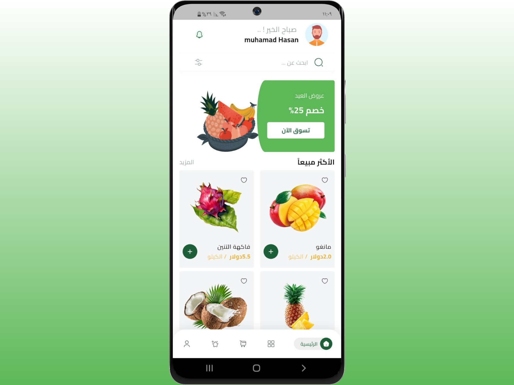
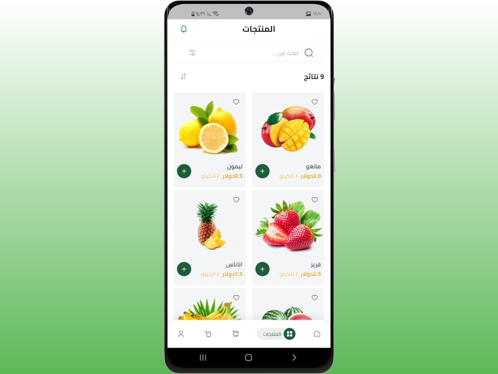
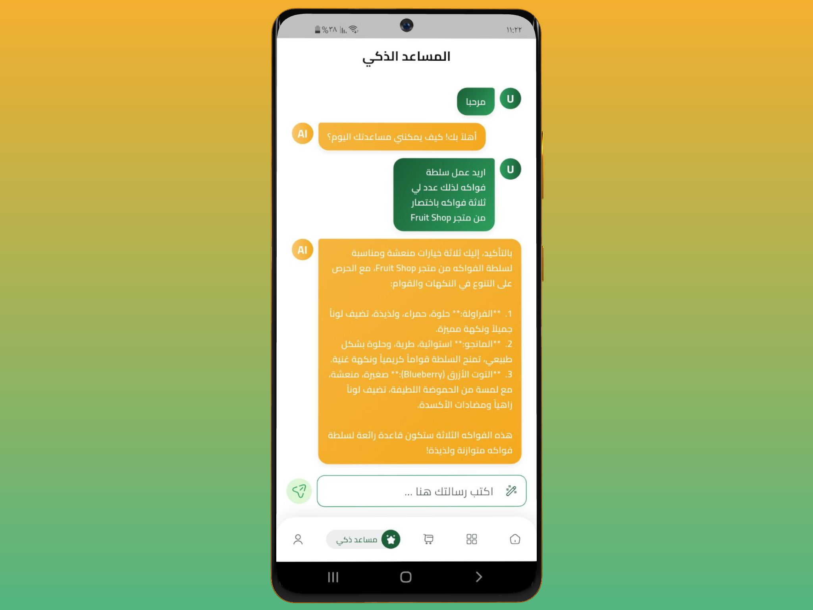
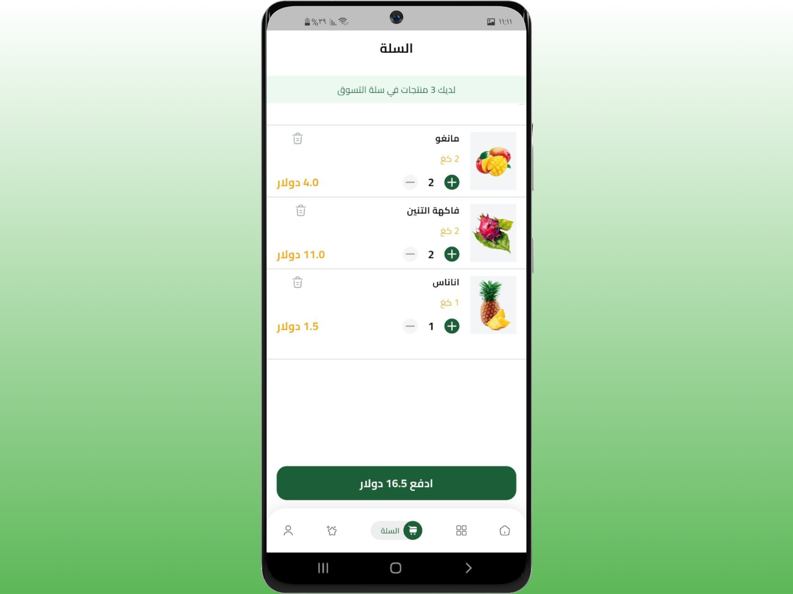

# 🍎 Fruit Shop — Mobile Fruit Store

A clean, user-friendly **mobile shopping app** for browsing, selecting, and purchasing fresh fruit.  
Designed with a **modern mobile shopping experience**, Fruit Shop delivers a smooth shopping experience with product discovery, cart management, promotional content, favorites, and an **AI-powered Smart Assistant** that suggests fruit combinations and recipes.

---

## ✨ Project Highlights

- 📱 Mobile-first UX optimized for iOS & Android  
- 🤖 AI-powered Smart Assistant for recommendations and recipes  
- 🛒 Smooth cart and checkout experience  
- 🎯 Clean UI with promotional banners and featured products  
- ❤️ Favorites (wish list) support  
- 🌍 Right-to-left (Arabic) ready & easily extendable for multiple languages  
- 🧱 Scalable architecture with modern state management

---

## 📸 Demo Screenshots

<table>
  <tr>
    <td align="center">
      
      
<strong>Home Screen</strong>

    </td>
    <td align="center">
      
      
<strong>Products Screen</strong>

    </td>
  </tr>
  <tr>
    <td align="center">
      
      
<strong>Smart Assistant — Conversation View</strong>

    </td>
    <td align="center">
      
      
<strong>Cart Screen</strong>

    </td>
  </tr>
</table>

---

## 🧠 Overview

Fruit Shop focuses on delivering a **simple, attractive, and intelligent shopping experience**:

- Admin dashboard for managing products and users  
- Product browsing with filtering and sorting  
- Cart management (add, remove, quantity control)  
- Promotional banners on the home screen  
- Favorites (wish list) feature  
- Built-in AI Smart Assistant for ordering help and recommendations  
- RTL-ready design with multi-language support potential

---

## 🤖 Smart Assistant

The **Smart Assistant** enhances user engagement by:

- Suggesting fruit combinations based on user preferences  
- Recommending healthy recipes  
- Assisting users during the ordering process  
- Answering product-related questions  

Powered by **Google Generative AI**, the assistant is designed to be **context-aware and extendable**.

---

## 🧩 Features

- Smooth, responsive mobile-focused UI  
- Scalable state management using modern patterns (Provider, Bloc/Cubit)  
- Real-time data handling and authentication  
- Clean, modular codebase ready for testing and CI  
- Easy integration with payment gateways and backend APIs

---

## 🧱 Architecture

The app follows a **clean and scalable architecture**:

- **Presentation Layer:** Flutter Widgets  
- **State Management:** Provider & Bloc (Cubit)  
- **Data Layer:** Firebase Firestore & Supabase Storage  
- **AI Layer:** Google Generative AI  

This structure ensures **maintainability, testability, and scalability**.

---

## 🛠️ Tech Stack

- **Frontend / Mobile:** Flutter (Dart)  
- **State Management:** Provider, Bloc (Cubit)  
- **Backend:** Firebase (Cloud Firestore, Authentication), Supabase (Storage)  
- **Payments:** PayPal or local payment gateway integration  
- **AI:** Google Generative AI
